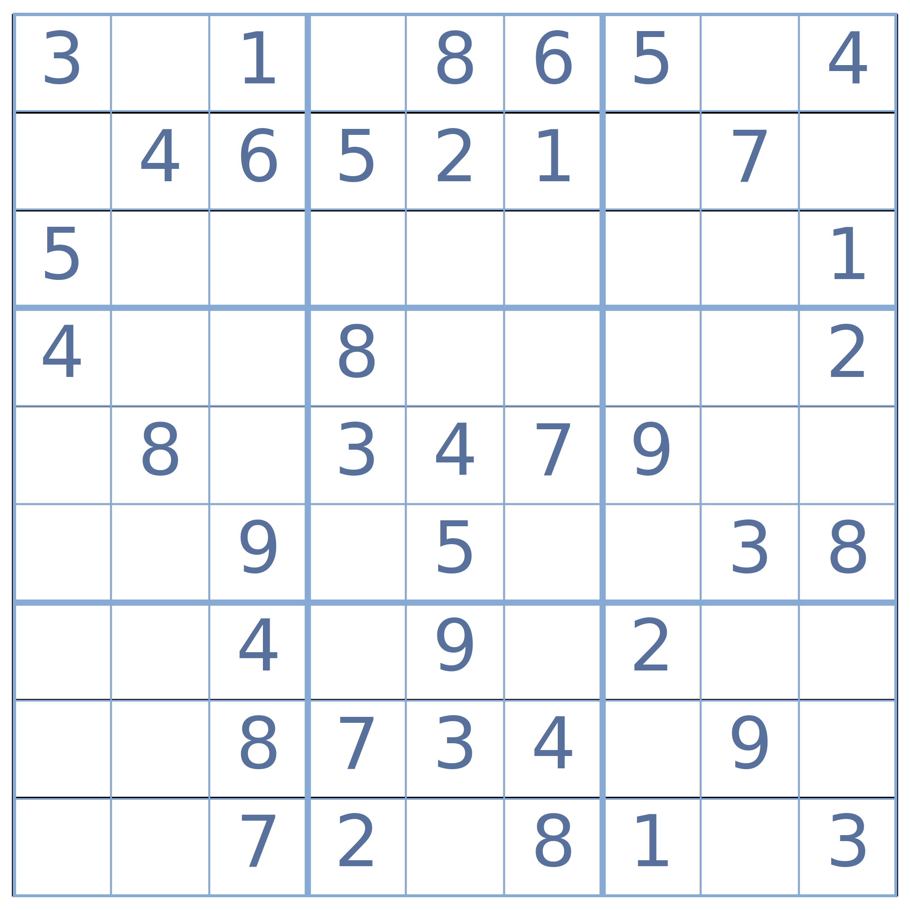
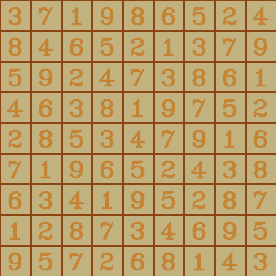

<h1 align="center">Sudoku Solver</h1>

## Introduction:
   Using OpenCV to extract and preprocess the Sudoku grid from the image. Recognize digits and blanks  and storing them in  matrix . Solve the puzzle using a depth-first search algorithm. Finally, output the solved Sudoku as a grid and convert it back into an image and save the image
  
## Table of Contents:
1) main.py
2) model.py
3) sudokualgo.py
4) utility.py
5) digit_recognition.keras

## Technology Stack:
  1) numpy
  2) opencv
  3) sklearn
  4) Tensorflow
  

## Contributors:

Team Name: Grid Guardians

* [Naina](https://github.com/nainaamodii)
* [Aadya](https://github.com/spicylemonade15)
* [Rishika Jain](https://github.com/rjain2006)
* [Nishi Gupta](https://github.com/nishi885)

### example:

## input: 

## Output:

### Made at:  

